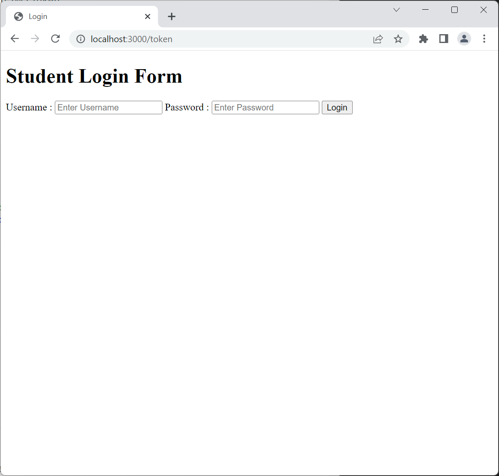

# Welcome to AK BE (Backend) Showcase

This is a small project to demostrate the use of nodejs to create a simple auth process with JWT.

## Project Setup

Clone this repo to your computer.

```bash
git clone https://github.com/adriankoh-sg/ak-be-text.git
```

Install dependencies.

```bash
npm install
```

## Runs App in the development mode

```bash
npm start
```

The App will run in http://localhost:3000

## To Check the BE response

Postman is used to check the resquest and response from the backend application.
Postman [collection](./postman/My%20NodeJS%20Backend.postman_collection.json)

### Check the login

Using postman, inside the body request:

```json
{
  "username": "adriankoh",
  "password": "123454321"
}
```


Using browser, it will display a login form.


### Login Success

Upon success, an `accessToken` will be returned.
Use the `accessToken` to access `/about`.

If the accessToken is correct, the data will return the username and password from DB.

> NOTE: password is a md5 hash of the password.

Using postman:

